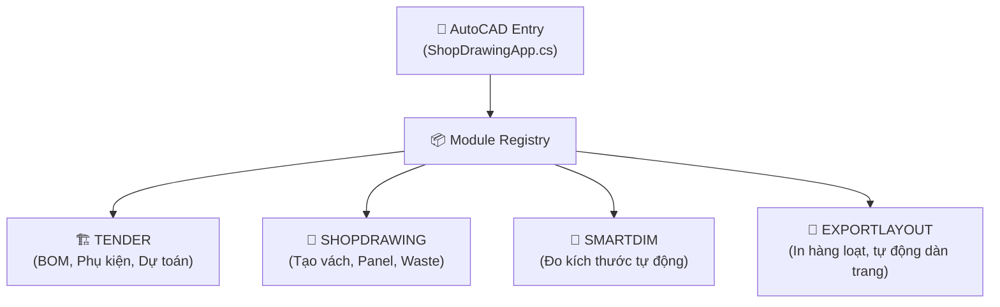

# ShopDrawing Plugin 🏗️

Plugin AutoCAD 2026 chuyên dụng cho quy trình triển khai bản vẽ Shopdrawing, Quản lý vật tư (BOM/Tender), Layout tự động và SmartDimension.

## 🌟 Trạng Thái Dự Án: Active Development & Stabilized
Đã hoàn thiện đợt Audit Stability toàn diện (v3.x), giải quyết triệt để các rủi ro crash (deadlock, empty catch, dispatcher threading, AutoCAD interop) để sẵn sàng môi trường production.

---

## 🏗️ Kiến Trúc Tổng Quan (v3)

Kiến trúc plugin được phân chia rõ ràng theo Registry Pattern, bao gồm 4 luồng nghiệp vụ chính:



### Phân rã tính năng theo Module
1. **Tender Module (`TenderBomCalculator`, `TenderProjectManager`)**: Xử lý toàn bộ logic tính toán vật tư, bóc khối lượng phụ kiện phòng sạch, trần/vách. Hỗ trợ xuất BOM ra báo giá và kiểm soát deadlock linh hoạt qua `_isEditingCell` flag.
2. **Shopdrawing Module (`BlockManager`, `WasteManagerDialog`)**: Quản lý block thư viện, cắt tấm mút, thuật toán nối tấm Panel chữ Z, tận dụng đầu thừa (Waste repository bằng SQLite).
3. **SmartDim Module (`SmartDimEngine`)**: Engine dim tự động kích thước cho vách, tường panel, hỗ trợ DimStyle động. Đã xử lý log/catch ngoại lệ toàn diện.
4. **ExportLayout Module (`LayoutManagerEngine`, `PdfExportEngine`)**: Xuất bản vẽ hàng loạt dựa trên khung tên, viewport auto-scale. Tích hợp giải pháp Fallback managed CVPORT thay vì P/Invoke lỗi thời.

---

## 🛠️ Stack Công Nghệ

- **Framework**: .NET 8 (`net8.0-windows`)
- **UI**: WPF (Windows Presentation Foundation)
- **AutoCAD API**: AutoCAD 2026 Managed API x64
- **Database**: SQLite (`Microsoft.Data.Sqlite`) lưu trữ Local Waste
- **Export**: NPOI xử lý xuất/nhập Excel (xls/xlsx)

---

## 🚀 Hướng Dẫn Setup Môi Trường & Build

### Yêu Cầu Hệ Thống
- Windows 10/11 x64
- Autodesk AutoCAD 2026
- .NET 8 SDK
- Visual Studio 2022 hoặc tương đương

### Thiết lập Reference AutoCAD
Project hiện đang map tới đường dẫn cài đặt mặc định của AutoCAD 2026. Hãy đảm bảo các thư mục sau tồn tại:
- `C:\Program Files\Autodesk\AutoCAD 2026\accoremgd.dll`
- `C:\Program Files\Autodesk\AutoCAD 2026\acdbmgd.dll`
- `C:\Program Files\Autodesk\AutoCAD 2026\acmgd.dll`
- `C:\Program Files\Autodesk\AutoCAD 2026\AdWindows.dll`

### Các bước Build & Chạy thử
1. Clone hoặc lại thư mục chứa cài đặt hiện có.
2. Khôi phục thư viện NuGet: 
   ```bash
   dotnet restore ShopDrawing.Plugin/ShopDrawing.Plugin.csproj
   ```
3. Build dự án:
   ```bash
   dotnet build ShopDrawing.Plugin/ShopDrawing.Plugin.csproj -c Debug
   ```
4. Sau khi build xong, file `ShopDrawing.Plugin.dll` sẽ nằm trong thư mục `ShopDrawing.Plugin\bin\Debug\net8.0-windows`.
5. Mở AutoCAD 2026, gõ lệnh `NETLOAD` và chỉ định tới file DLL trên.

---

## 📊 Trạng Thái Modules

| Module | Chức năng chính | Trạng thái |
|--------|-----------------|------------|
| **Core Framework** | Registry, CAD Threading lock, Logging | 🟢 Stable |
| **Waste Repository** | SQLite DB, Matcher, Tái tạo rác thừa | 🟢 Stable |
| **Tender BOM** | Bóc BOM phụ kiện phòng sạch, Editable Grid | 🟢 Stable (đã fix crash) |
| **Shopdrawing** | Setup lưới vách Panel, Cắt nối Joint | 🟡 In-Progress |
| **Layout & PDF** | Xếp viewport auto-scale, Xuất PDF/Model | 🟢 Stable |
| **SmartDimension** | Tự động Dimension các layer khung thép | 🟢 Stable |
| **Test Coverage** | Unit test thuật toán `TenderBom` và `LayoutPacking` | 🟡 In-Progress |

---

## 📁 Cấu Trúc Mã Nguồn

- `/ShopDrawing.Plugin/` - Chứa toàn bộ source code của C# AutoCAD Addin.
  - `/Core/` - Lõi thao tác CAD an toàn, `SafeCadLock`, Logging, Native Fallbacks.
  - `/Data/` - SQLite Repository (Quản lý Waste).
  - `/Models/` - Các model dữ liệu nghiệp vụ.
  - `/UI/` - Layout WPF UI (Dialogs, Control Palettes).
- `/ShopDrawing.Tests/` - Môi trường NUnit tests.
- `/artifacts/` - Các báo cáo đánh giá, Report Audit hệ thống.
- `/public/` - Dữ liệu nội bộ mẫu, file database rỗng để test.
- `/docs/` - System Design & Hướng dẫn sử dụng phòng sạch.

---

## 🔒 Kiểm Soát Lỗi & An Toàn 
Dự án áp dụng chặt chẽ các nguyên lý **Fail-Safe**:
- Giao tiếp giữa WPF và AutoCAD DB thông qua cơ chế `SafeCadLock.TryLock()` để phòng tránh Document Lock Deadlocks.
- `P/Invoke` native (gọi `acad.exe` hay `SetDllDirectory`) được bọc trong các block `try-catch` kiểm soát Exception an toàn tuyệt đối.
- Toàn bộ exception được redirect về file log `PluginLogger`, không tồn tại block `catch {}` rỗng gây mất dấu lỗi.

---

## 🚢 Quy Trình Deploy & Auto Update

### Release hiện tại
- Release đã phát hành thành công trên GitHub Releases.
- Bản cài mới cho team dùng file `ShopDrawing.Setup.<version>.zip`.
- Plugin đã cài sẵn sẽ kiểm tra `latest.json` để báo cập nhật.

### Cách phát hành bản mới
1. Chốt code trên `master`.
2. Chạy script release trong root repo:
   ```powershell
   powershell -ExecutionPolicy Bypass -File .\scripts\release.ps1 -Version 0.1.7
   ```
3. Nếu local đã commit nhưng chưa push:
   ```powershell
   powershell -ExecutionPolicy Bypass -File .\scripts\release.ps1 -Version 0.1.7 -PushLatestCommit
   ```
4. Theo dõi workflow:
   ```powershell
   powershell -ExecutionPolicy Bypass -File .\scripts\watch-release.ps1 -Version 0.1.7
   ```
5. Sau khi workflow xanh, gửi file `ShopDrawing.Setup.0.1.7.zip` cho người cần cài mới.

### Asset tạo ra sau mỗi release
- `ShopDrawing.Setup.X.Y.Z.zip`: file gửi cho team khi cài mới
- `ShopDrawing.Installer.exe`: installer/updater
- `ShopDrawing.bundle.zip`: AutoCAD bundle
- `latest.json`: manifest để plugin kiểm tra bản mới

### Máy dev có cần luôn bật không
- Không cần để team dùng plugin hằng ngày.
- Chỉ cần online khi build và phát hành release mới vì self-hosted runner đang nằm trên máy dev.
- Release đã publish lên GitHub thì team vẫn tải và update bình thường dù máy dev đang tắt.

### Làm runner ổn định hơn
- Có thể cài watchdog local bằng:
  ```powershell
  powershell -ExecutionPolicy Bypass -File .\scripts\install-runner-tasks.ps1
  ```
- Cách này tạo user-level autostart guard trong `HKCU\Software\Microsoft\Windows\CurrentVersion\Run` và tự bật lại runner nếu nó tắt.
- Nếu cần mức ổn định cao nhất sau reboot/logout, chuyển runner sang Windows Service theo [docs/runner-service.md](C:\my_project\shopdrawing-app\docs\runner-service.md).

### Runtime data của plugin nằm ở đâu
- `%AppData%\ShopDrawing\shopdrawing_plugin.log`
- `%AppData%\ShopDrawing\Data\shopdrawing_waste.db`
- `%AppData%\ShopDrawing\Data\panel_specs.json`
- `%AppData%\ShopDrawing\Data\tender_projects\*.json`

Các file này là data local/runtime, không đi theo git và không nên để chung với thư mục bản vẽ gửi khách.

### Tài liệu vận hành
- [docs/release-autoupdate.md](C:\my_project\shopdrawing-app\docs\release-autoupdate.md)
- [docs/deploy-runbook.md](C:\my_project\shopdrawing-app\docs\deploy-runbook.md)
- [docs/runner-service.md](C:\my_project\shopdrawing-app\docs\runner-service.md)

---

## Deploy Runbook (Updated 2026-04-10)

Muc tieu: deploy on dinh, khong mat tab `ShopDrawing`, khong lap lai loi update.

### 1) Quy trinh phat hanh chuan
1. Commit code len `master`.
2. Chay release script:
   ```powershell
   powershell -ExecutionPolicy Bypass -File .\scripts\release.ps1 -Version X.Y.Z
   ```
3. Theo doi workflow:
   ```powershell
   powershell -ExecutionPolicy Bypass -File .\scripts\watch-release.ps1 -Version X.Y.Z
   ```
4. Chi thong bao team cap nhat khi workflow `build-release` da xanh va assets da du.

### 2) Checklist bat buoc truoc khi thong bao team update
- `latest.json` tro dung tag vua release.
- Release co du 4 assets:
  - `ShopDrawing.Setup.X.Y.Z.zip`
  - `ShopDrawing.Installer.exe`
  - `ShopDrawing.bundle.zip`
  - `latest.json`
- Test local 1 lan:
  - CAD hien tab `ShopDrawing`.
  - Lenh `Update` hoat dong.
  - Sau khi dong CAD va mo lai, version da tang.

### 3) Co che update da chot (hien tai)
- Khi bam `Update`, plugin se mo updater.
- Uu tien dung installer local de popup dong CAD xuat hien nhanh.
- Installer ghi ket qua vao `%APPDATA%\Autodesk\ApplicationPlugins\shopdrawing_update_result.json`.
- Updater co thong bao desktop khi xong.
- Lan mo CAD tiep theo plugin doc marker va hien thong bao thanh cong/that bai.

### 4) Bai hoc xu ly loi da gap
- Loi 1: cai nham `install-dir` vao `...\Contents\Windows` -> sinh bundle long.
  - Da fix: normalize install root ve `%APPDATA%\Autodesk\ApplicationPlugins`.
- Loi 2: cua so den updater.
  - Da fix: plugin mo updater voi `CreateNoWindow=true`, installer build `WinExe`.
- Loi 3: update fail va mat tab do lock `ShopDrawing.Installer.exe`.
  - Da fix: installer copy/merge an toan, khong xoa bundle theo cach lam lock file dang chay.
- Loi 4: cho lau truoc popup dong CAD.
  - Da fix: khong block doi tai installer moi truoc khi mo prompt.

### 5) Quy tac van hanh cho team
- Khi da bam update: dong CAD va cho thong bao updater xong roi moi mo lai CAD.
- Neu mo CAD qua som, update co the fail va phai chay lai.
- Neu may dang o trang thai loi (khong thay tab), cai tay 1 lan bang:
  - `ShopDrawing.Setup.X.Y.Z.zip` (ban moi nhat).

### 6) Nhat ky va duong dan can check khi co su co
- `%APPDATA%\Autodesk\ApplicationPlugins\shopdrawing_installer.log`
- `%APPDATA%\Autodesk\ApplicationPlugins\shopdrawing_update_result.json`
- `%APPDATA%\Autodesk\ApplicationPlugins\ShopDrawing.bundle\PackageContents.xml`

### 7) Ban baseline on dinh
- Baseline deploy on dinh moi nhat: `v0.1.30`.
